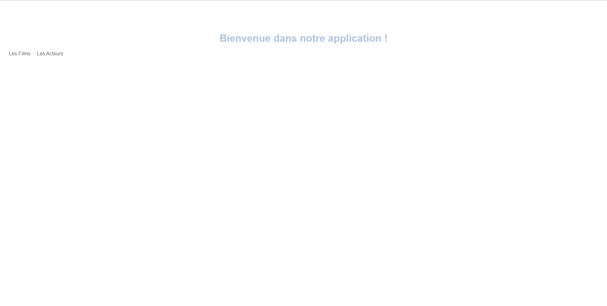

# hello-world

## Project setup
You must have NodeJS (with npm) installed and Vuejs as well
```
cd CinemaClient
npm install
```

### Deploy the webApplication
```
npm run serve
```
Now you can connect to the webApplication on the link prompted in ur console 


