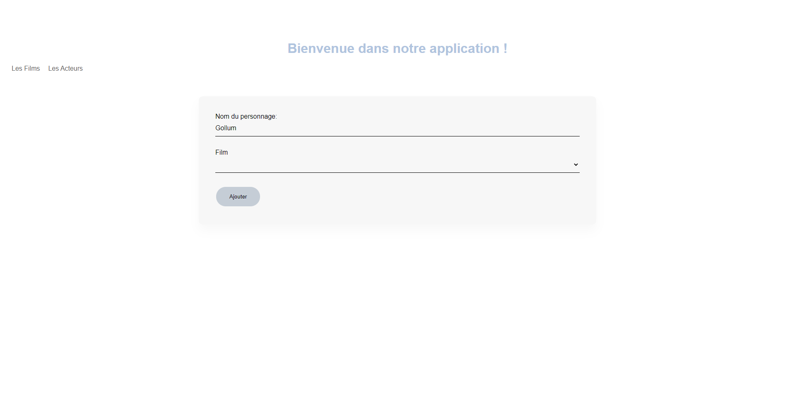

# CinemaClient

## Project setup
You must have NodeJS (with npm) installed and Vuejs as well
Then type the following commands before run the project 
```
git clone https://github.com/PaulEdouardLegrand/CinemaClient.git
cd CinemaClient
npm install
```

### Deploy the webApplication
```
npm run serve
```
Now you can connect to the webApplication on the link prompted in ur console and u will reach a page looking like this


Now you can navigate in the webApplication with the "Acteurs" and "Films" fields

The Films fields will bring u to the following page where u can saw the movies referenced in our webApp


If you click on the "Acteurs" field you will see the following page 


By Double clicking on a an actor u will access to all the character played by the actor 


You can add a new character to the actor by double clicking on the "ajouter" button. Once clicked you will access to this page where u will need to complete a form 



By double clicking on the "modifier" button you will access to a similar form as for "ajouter" but with the différents fields complete with the fields of the character you decided to modify


You can also delete a character by double clicking on the "supprimer" button 

At the end of each action you go back to the actors vue
